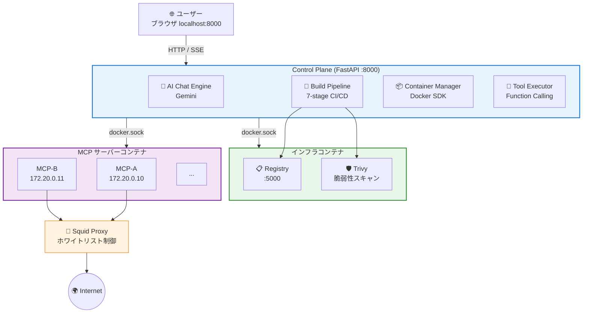
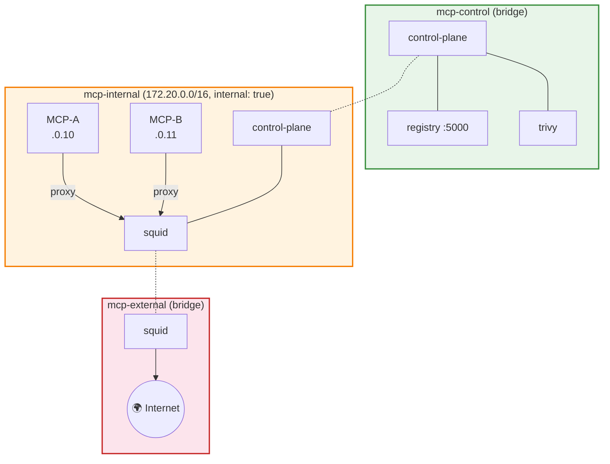
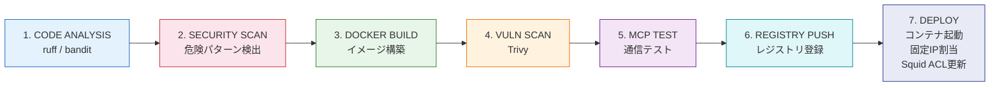

# MCP Container Control Plane

AI チャットで MCP (Model Context Protocol) サーバーを自動生成・コンテナ化・管理するシステム。

Gemini AI との対話で「天気取得APIのMCPサーバーを作って」と指示するだけで、コードの生成からセキュリティスキャン、Dockerコンテナとしてのデプロイまでを全自動で実行します。

---

## 目次

- [システム概要](#システム概要)
- [アーキテクチャ](#アーキテクチャ)
- [コンテナ構成](#コンテナ構成)
- [ネットワーク構成](#ネットワーク構成)
- [機能一覧](#機能一覧)
- [ビルドパイプライン](#ビルドパイプライン)
- [セキュリティ](#セキュリティ)
- [API 仕様](#api-仕様)
- [技術スタック](#技術スタック)
- [セットアップ](#セットアップ)
- [ディレクトリ構成](#ディレクトリ構成)

---

## システム概要



---

## アーキテクチャ

### 設計思想

| 原則 | 実現方法 |
|------|----------|
| **AI-Driven** | チャットで指示するだけでMCPサーバーが生成される |
| **Secure by Default** | 非rootコンテナ、読み取り専用FS、ホワイトリストプロキシ |
| **Full CI/CD** | 7段階のビルドパイプラインで品質を保証 |
| **Function Calling** | 稼働中のMCPツールをチャットから直接呼び出し可能 |
| **Zero Config** | `setup.sh` 一発でセットアップ完了 |

---

## コンテナ構成

### インフラコンテナ（docker-compose で管理）

| コンテナ | イメージ | 役割 | ポート |
|----------|----------|------|--------|
| `mcp-control-plane` | カスタムビルド | 管理UI + AI エージェント + API | 8000 |
| `mcp-squid` | `ubuntu/squid:latest` | 外部通信プロキシ（ホワイトリスト制御） | 3128 (内部) |
| `mcp-registry` | `registry:2` | プライベート Docker レジストリ | 5000 (内部) |
| `mcp-trivy` | `aquasec/trivy:latest` | コンテナイメージ脆弱性スキャナー | — |

### MCPサーバーコンテナ（動的生成）

| 項目 | 値 |
|------|-----|
| ベースイメージ | `mcp-base:latest`（自動ビルド） |
| Python | 3.12-slim-bookworm |
| 実行ユーザー | `mcpuser` (UID 10001、非root) |
| PID 1 | tini |
| ルートFS | 読み取り専用 |
| tmpfs | `/tmp` (64MB) |
| メモリ上限 | 256MB |
| CPU | 50% 上限 |
| PID 上限 | 64 |
| ケーパビリティ | ALL ドロップ |
| ネットワーク | `mcp-internal`（固定IP: 172.20.0.10〜） |
| 外部通信 | Squid 経由のみ（ホワイトリスト制限） |

---

## ネットワーク構成



| ネットワーク | タイプ | サブネット | 用途 |
|-------------|--------|-----------|------|
| `mcp-control` | bridge | — | Control Plane ↔ Registry / Trivy |
| `mcp-internal` | **internal** | 172.20.0.0/16 | MCP コンテナ間 + Squid |
| `mcp-external` | bridge | — | Squid → インターネット |

> `mcp-internal` は `internal: true` のため、MCPコンテナから直接インターネットにアクセスできません。すべての外部通信は Squid プロキシ経由です。

---

## 機能一覧

### 💬 AI チャット（MCP サーバー生成）

| 機能 | 説明 |
|------|------|
| 自然言語でのサーバー生成 | 「天気取得のMCPサーバーを作って」→ コード自動生成 |
| ストリーミング応答 | SSE で AI の応答をリアルタイム表示（3行プレビュー） |
| 仕様カード | ツール名・引数・説明を見やすいUIで表示 |
| ビルド/スキップ選択 | ビルドしない場合は折りたたみ、後からビルド可能 |
| 一般会話対応 | MCP以外の質問・雑談にも自然に回答 |
| Function Calling | 稼働中のMCPツールをチャットから直接呼び出し |

### 📝 コンテナ編集チャット

| 機能 | 説明 |
|------|------|
| 既存コードの修正 | 「エラーハンドリングを追加して」→ コード修正 & 再ビルド |
| ツール解説 | 「ツールの説明をして」→ 機能・使い方の解説（コード変更なし） |
| ツール試し呼び出し | 編集チャットからもMCPツールを呼び出し可能 |

### 🔧 ツールテスト

| 機能 | 説明 |
|------|------|
| パラメータ入力UI | 各ツールの引数を入力して実行 |
| async対応 | `async def` のツールも `asyncio.run()` で自動実行 |
| エラー検出 | 結果のパターンマッチでエラーを視覚表示 |

### 📋 コンテナ管理

| 機能 | 説明 |
|------|------|
| 一覧表示 | サイドバーにステータスバッジ付きカード表示 |
| 起動 / 停止 / 削除 | 常時表示のアクションボタン |
| コードビューア | 生成されたサーバーコードを確認 |
| ビルドログ | プログレスバー付きのリアルタイムログ |

### 🔄 Function Calling（MCPツール呼び出し）

| 機能 | 説明 |
|------|------|
| 自動ツール検出 | 稼働中コンテナのツールを自動収集 |
| Gemini連携 | FunctionDeclaration として AI に提供 |
| 実行表示 | 🔄 呼び出し中 → ✅ 結果表示のアニメーション |
| 複数ラウンド | ツール結果に基づいて追加呼び出し（最大5ラウンド） |

---

## ビルドパイプライン

MCPサーバーの生成からデプロイまで **7段階** のCI/CDパイプラインを実行します。



| ステージ | 処理内容 | 失敗時 |
|---------|---------|--------|
| **1. CODE_ANALYSIS** | ruff (lint) + bandit (セキュリティ lint) | 中断 |
| **2. SECURITY_SCAN** | `exec`, `eval`, `subprocess` 等の禁止パターン検出 | 中断 |
| **3. DOCKER_BUILD** | `mcp-base` の上にユーザーコードを配置、依存パッケージインストール | 中断 |
| **4. VULNERABILITY_SCAN** | Trivy による CRITICAL 脆弱性スキャン | ベースイメージ由来なら続行 |
| **5. MCP_TEST** | MCP プロトコルで接続し、ツール一覧を取得 | 中断 |
| **6. REGISTRY_PUSH** | プライベートレジストリ (localhost:5000) にイメージを push | 中断 |
| **7. DEPLOY** | コンテナ起動、固定IP割り当て、Squid ホワイトリスト更新 | 中断 |

---

## セキュリティ

### 多層防御

| レイヤー | 対策 |
|---------|------|
| **コード生成** | システムプロンプトで危険コードを禁止 |
| **静的解析** | ruff + bandit によるコード品質・セキュリティチェック |
| **パターン検出** | `exec`, `eval`, `subprocess`, `os.system`, `pickle`, `ctypes` 等を検出 |
| **コンテナ分離** | 非root、読み取り専用FS、cap_drop ALL、メモリ/CPU/PID制限 |
| **ネットワーク分離** | internal ネットワーク + Squid ホワイトリスト |
| **脆弱性スキャン** | Trivy による CRITICAL 脆弱性の検出 |

### コンテナセキュリティ設定

```python
{
    "user": "10001:10001",          # 非rootユーザー
    "read_only": True,              # 読み取り専用ルートFS
    "cap_drop": ["ALL"],            # 全ケーパビリティ除去
    "security_opt": ["no-new-privileges:true"],
    "mem_limit": "256m",            # メモリ上限
    "cpu_quota": 50000,             # CPU 50% 上限
    "pids_limit": 64,               # プロセス数上限
    "tmpfs": {"/tmp": "size=64m"},  # tmpfs のみ書き込み可
}
```

---

## API 仕様

### チャット API

| メソッド | パス | 説明 |
|---------|------|------|
| `GET` | `/api/chat/stream?message=...` | AI チャット（SSE ストリーム） |
| `POST` | `/api/chat/build` | 最後のAI応答からビルド実行 |
| `POST` | `/api/chat/reset` | チャットセッションリセット |

### コンテナ管理 API

| メソッド | パス | 説明 |
|---------|------|------|
| `GET` | `/api/containers` | コンテナ一覧 |
| `POST` | `/api/containers/{name}/start` | コンテナ起動 |
| `POST` | `/api/containers/{name}/stop` | コンテナ停止 |
| `DELETE` | `/api/containers/{name}` | コンテナ削除 |
| `GET` | `/api/containers/{name}/code` | サーバーコード取得 |

### コンテナ編集チャット API

| メソッド | パス | 説明 |
|---------|------|------|
| `GET` | `/api/containers/{name}/chat/stream?message=...` | 編集チャット（SSE） |
| `POST` | `/api/containers/{name}/chat/apply` | コード修正を適用 & 再ビルド |
| `POST` | `/api/containers/{name}/chat/reset` | 編集セッションリセット |

### ツール API

| メソッド | パス | 説明 |
|---------|------|------|
| `GET` | `/api/containers/{name}/tools` | ツール一覧（AST解析） |
| `POST` | `/api/containers/{name}/tools/{tool}/test` | ツールテスト実行 |

### ビルド API

| メソッド | パス | 説明 |
|---------|------|------|
| `GET` | `/api/build/{name}/status` | ビルド進捗（SSE ストリーム） |

### その他

| メソッド | パス | 説明 |
|---------|------|------|
| `GET` | `/health` | ヘルスチェック |
| `GET` | `/` | Web UI |

---

## 技術スタック

| カテゴリ | 技術 | バージョン |
|---------|------|-----------|
| **バックエンド** | Python | 3.12 |
| | FastAPI | 0.129.0 |
| | Uvicorn | 0.41.0 |
| **AI** | Google Gemini (google-adk) | 1.25.0 |
| | モデル | gemini-2.5-flash (設定可能) |
| **コンテナ** | Docker | 28.x |
| | Docker Compose | v2 |
| | Docker SDK for Python | 7.1.0 |
| **MCPプロトコル** | mcp[cli] | 1.26.0 |
| **HTTP クライアント** | httpx | 0.28.1 |
| **セキュリティ** | ruff (linter) | 0.9.9 |
| | bandit (security linter) | 1.8.3 |
| | Trivy (脆弱性スキャン) | latest |
| **フロントエンド** | Vanilla JS + CSS | — |
| | marked.js (Markdown) | 12.0.1 |
| | highlight.js (シンタックスハイライト) | 11.9.0 |
| **プロキシ** | Squid | latest |
| **レジストリ** | Docker Registry | 2 |

---

## セットアップ

### 前提条件

- Ubuntu 22.04+ / Debian 12+ (x86_64)
- `sudo` 権限
- Google AI API キー（[Google AI Studio](https://aistudio.google.com/apikey) で取得）

### クイックスタート

```bash
# 1. リポジトリをクローン
git clone <repository-url>
cd mcp-adk

# 2. セットアップスクリプトを実行
sudo ./setup.sh

# 3. API キーを設定
nano .env
# GOOGLE_API_KEY=your_actual_key_here

# 4. Control Plane を再起動（APIキー反映）
docker compose restart control-plane

# 5. ブラウザでアクセス
# http://localhost:8000
```

### 手動セットアップ

```bash
# Docker & Docker Compose v2 をインストール
# https://docs.docker.com/engine/install/

# 環境変数を設定
cp .env.example .env
nano .env  # GOOGLE_API_KEY を設定

# データディレクトリを初期化
mkdir -p data/{squid/whitelist,server_configs,build_workspace,registry}

# ビルド & 起動
docker compose up -d --build

# ヘルスチェック
curl http://localhost:8000/health
```

### 運用コマンド

```bash
# 全コンテナの状態確認
docker compose ps

# ログの確認
docker compose logs -f control-plane

# 停止
docker compose down

# 起動（データ保持）
docker compose up -d

# Control Plane のみ再ビルド
docker compose up -d --build control-plane
```

---

## ディレクトリ構成

```
mcp-adk/
├── setup.sh                     # セットアップスクリプト
├── docker-compose.yml           # インフラ定義
├── requirements.txt             # Control Plane 依存パッケージ
├── .env.example                 # 環境変数テンプレート
│
├── control_plane/               # Control Plane アプリケーション
│   ├── main.py                  # FastAPI エントリポイント
│   ├── config.py                # 設定
│   │
│   ├── api/                     # API エンドポイント
│   │   ├── build.py             #   ビルドパイプライン
│   │   ├── chat.py              #   AI チャット (SSE)
│   │   ├── container_chat.py    #   コンテナ編集チャット
│   │   ├── containers.py        #   コンテナ CRUD
│   │   └── test.py              #   ツールテスト
│   │
│   ├── models/                  # Pydantic モデル
│   │   ├── build.py             #   ビルド状態
│   │   ├── container.py         #   コンテナ情報
│   │   └── server.py            #   サーバー設定
│   │
│   ├── services/                # ビジネスロジック
│   │   ├── build_pipeline.py    #   7段階ビルドパイプライン
│   │   ├── code_generator.py    #   AI コード生成 + Function Calling
│   │   ├── container_manager.py #   Docker コンテナ管理
│   │   ├── mcp_tester.py        #   MCP 通信テスト
│   │   ├── registry_client.py   #   Registry クライアント
│   │   ├── security_scanner.py  #   セキュリティスキャン
│   │   └── tool_executor.py     #   MCP ツール実行 (FC用)
│   │
│   ├── prompts/                 # AI プロンプト
│   │   ├── create_prompt.txt    #   MCP サーバー生成用
│   │   └── edit_prompt.txt      #   コード編集用
│   │
│   ├── static/                  # フロントエンド
│   │   ├── css/styles.css
│   │   └── js/app.js
│   │
│   └── templates/
│       └── index.html           # SPA テンプレート
│
├── docker/                      # Dockerfile
│   ├── control-plane/
│   │   └── Dockerfile
│   └── mcp-base/
│       ├── Dockerfile           # MCP コンテナベースイメージ
│       ├── requirements.txt
│       └── entrypoint.sh
│
└── data/                        # 永続データ (Git管理外)
    ├── squid/
    │   ├── squid.conf           # Squid 設定
    │   └── whitelist/           # ドメインホワイトリスト
    ├── server_configs/          # MCP サーバー設定 JSON
    ├── build_workspace/         # ビルド作業ディレクトリ
    └── registry/                # Docker Registry データ
```

---

## ライセンス

MIT License
